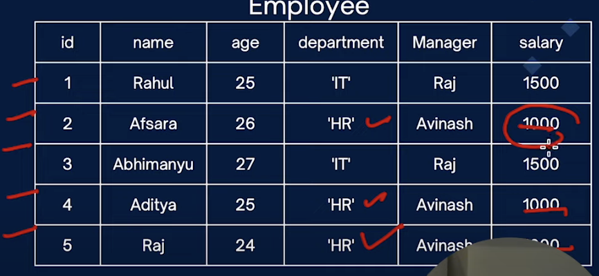
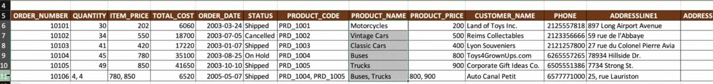
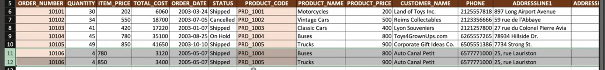
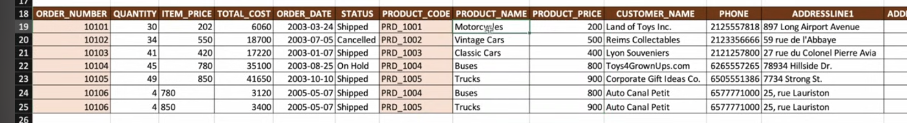
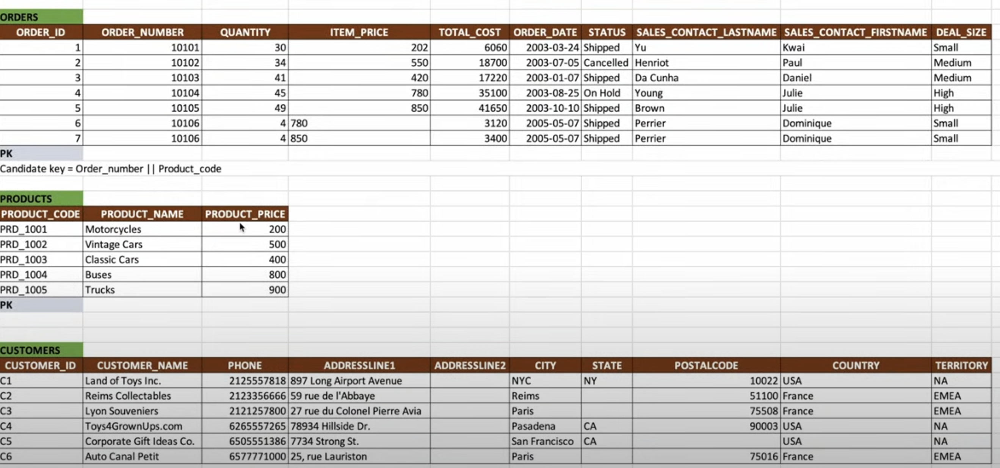
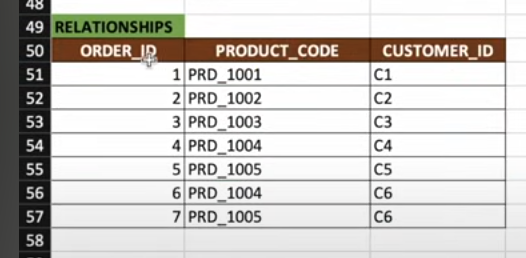
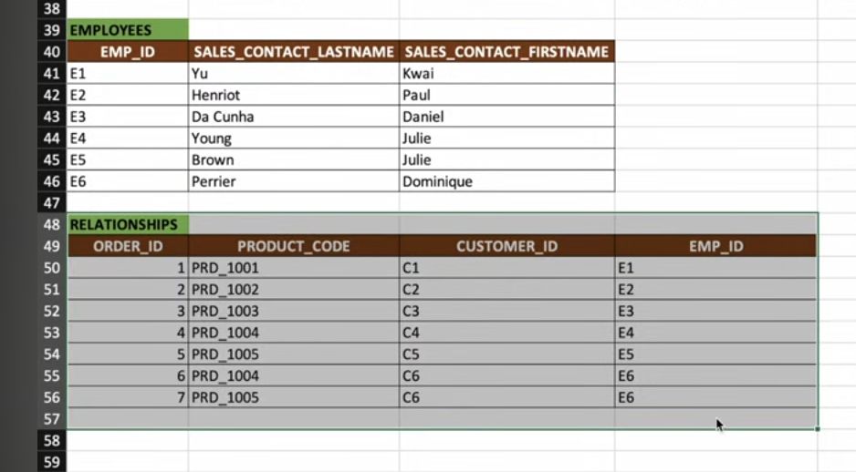

**Definition**

A relational database stores data in tables made of rows and columns, and uses keys to relate different tables. It allows easy access and management using SQL.

-------------

**Normalisation**

**Normalisation** is the process of organising data in a database to **reduce redundancy (duplicate data)** and **improve consistency**.  
It involves **splitting a large table into two or more smaller related tables**.

 **Insertion Anomaly**

An **insertion anomaly** occurs when it's **difficult to add data** into a database because **some required data is missing**.

**Example:**  
1. You want to add a **new department**, but can't do it unless there's at least **one employee** in that department.
2. Suppose a student taking an admission in 6th, But we don't know which section it is so while inserting data, there is an absence of data. 

**Deletion Anomaly**

A **deletion anomaly** happens when **removing a record** also deletes **important related data**.

**Example:**  
If you delete all employee records, you might also **lose information about departments**, their **managers**, and **salaries** — even though that data is still needed.

**Update Anomaly**

An **update anomaly** happens when **changing a value** requires **multiple updates in the table**.

**Example:**  
If you want to **increase the salary** for all employees in the **HR department**, you must update the value in **every HR employee's record**. If you miss one, the data becomes **inconsistent**.

**1NF**

Every column need to have single value.
Every row should be unique. either through a single column table or multiple column table

In this image 2 values are coming in same column this should not happen.

So here we have make an composite key of two column to uniquely identify the rows

**2NF**

1. Must be in 1NF
    
2. All non-key attributes must be fully dependent on candidate key.  
        _i.e., If a non-key column is partially dependent on candidate key (subset of columns forming candidate key) then split them into separate tables._
    
3. Every table should have a primary key and relationship between the tables should be formed using foreign key.

**Candidate Key:**

- Set of columns which uniquely identify a record.
    
- A table can have multiple candidate keys because there can be multiple sets of columns which uniquely identify a record/row in a table.

**Non-key Columns:**

- Columns which are not part of the candidate key or primary key.

**Partial Dependency:**

- If your candidate key is a combination of 2 columns (or multiple columns), then every non-key column (columns which are not part of the candidate key) should be fully dependent on all the columns of the key.
    
- If there is any non-key column which depends only on one of the candidate key columns, then this results in partial dependency.

Example:
So here I have table in that we are considering candidate key as (ORDER_NUMBER, PRODUCT_CODE) but like we have few non key columns like(Quantity, ITEM_PRICE, TOTAL_COST, ORDER_DATE, STATUS) so these columns are only depends upon ORDER_NUMBER so we can separate this into two different tables.
Similarly (PRODUCT_NAME, PRODUCT_PRICE) is depend upon PRODUCT_CODE so again
we can separate it out these tables also.

After separating out the table it looks like these so here we have introduce the 3 new columns
ORDER_ID, PRODUCT_CODE(removed duplicate), CUSTOMER_ID.

Now following the 2nd point we have to make the relationship between them.

**3NF**
1. Avoid Transitive dependencies.

So Transitive dependencies is lets say we three column A, B, C. If A is a functionally dependent on B and B is functionally dependent on C than we can say A is functionally dependent on C.
Example : We have one column CUSTOMER_NAME(A) which is dependent on ORDER_ID(B) and we have another column SALES_PERSON_NAME(C) which is dependent on ORDER_ID(B) so in a way if we know column CUSTOMER_NAME we can get the ORDER_ID and we know ORDER_ID than we can get the data of  SALES_PERSON_NAME. so this is called transitive dependencies.

So we will separate out SALES_DETAILS and remove the duplicates and create a relationship.

-------------

**ACID Properties**

It ensures that transaction are processed reliably and accurately.

A -> Atomicity: It ensures a single unit of work Either execute all operations (commit) or none of them are applied (rollback).

Example: so ram is transferring money to Shyam account so money should get deducted from ram account and get credited to Shyam account as a single operation so if at any movement any transaction fails (due to Network Failure/system crash) so the entire transaction should get rollback.

C -> Consistency: Read should fetch upto date data and write shouldn't violate integrity constraints.
1. Read operation retrieve consistent and up-to-date data from the database.
2. Write operation ensures that data modification maintain the database constraints.(such as
    foreign key relationships or unique constraints so that data remain accurate).
    
Example: Suppose you have ₹X in your account and Ram has ₹R. At the same time, you transfer ₹Y to Ram, and Ram transfers ₹Z to you. Even though these transactions happen simultaneously, the total amount of money in both accounts should remain the same.
    
I -> Isolation: One transaction should be independent from others.
3. it ensures that if there are two transaction 1 and 2, then the changes made by transaction 1
   are not visible to transaction 2 until transaction 1 is commit.

Example:  Transaction 1 update value A to 50 (previously A value was 40)
         Transaction 2 read/get/fetch value A
         if Transaction 1 is committed according to Transaction 2 the value of A = 50
         if Transaction 1 is pending/running according to Transaction 2 the value of A = 40
         which is shown as data inconsistency so we should always wait for Transaction 1 to complete first for data consistency.
         
D -> Durability: The committed transaction should remain even after a failure/crash.

Example: if ram is transferring X money to Shyam account so we will check balance and
deduct the money from ram account and suppose our data is in committed phase and system got crash or encounter network failure. so when the system backup both ram and Shyam account will reflected with updated balance.

-------------

**Transactions**

Transaction is a unit of work that consist one or more database operation (read/write/commit/rollback) and read and write in transaction follows the ACID property.

So here we are making an order in swiggy but if we get network failure so if any money got deducted it will get rollback to our account otherwise if no issues has been encounter than transaction will be successful.
here how things are working is for making an swiggy order it has to cut some money from my account create an order etc. so each operation is an transaction so every transaction will get stored in transaction log and if everything got success than it will go to commit phase and from their data will get saved into database.

Example :

**Concurrency Control**
Concurrency ensures that multiple transaction can run concurrently without compromising data consistency.

Example:
1. Ram is giving 100rs to Shyam.
2. Shyam is giving 50rs to ram.
So both are different transaction T1 and T2 and it is trying to modify the same value so T1 should be independent for T2 and data should be consistent.

Some technique used here is:
1. Locking (Pessimistic, Optimistic)
2. Two-Phase Locking
3. Timestamp ordering

***Concurrency Control Mechanism***
It is a process of managing multiple user access and modification in data simultaneously in shared or multi-user database systems.

How it helps? -> Data consistency, Isolation Serializable

So these mechanism is needed to ensure that transactions are executed concurrently without leading to any inconsistencies in the database. we have some technique to make a schedule serializable.

Lost Updates: when two or more transaction update the same data simultaneously, one of the data might lost for example if two user modify the same record at the same time the change made by one user could be overwrite the changes made by other user.

Dirty Read: when a transaction reads the data which has been modified by other transaction but not committed yet and if the transaction rollback, the other transaction will have invalid data.

**Scenario**
Many concurrent request tries to book same ticket?

So initially when 3 user tries to book a seat so at the same time all 3 request for same seat that in DB status is free so for all 3 user this will get booked

how we will solve this?
we can use synchronize so at a time only one user1 have access so user 1 will book the ticket and other two user will not be able to book the ticket but **is it good from distributed system**?

So the problem will be in one process multiple threads are there so synchronize will be able to handle the request but suppose we have microservice in that their will be multiple processes so in that case synchronize will not work and it will give the error comes optimistic and pessimistic locking.

**DB Locking make sure that no other transaction update the locker rows.**
1. **shared lock** (suppose one transaction acquire the shared lock than only read can happen but not write by other transaction but here multiple transaction can have shared lock only for reading) 
	Allows multiple transactions to read a data item simultaneously
    but prevents any of them from modifying it. Multiple transactions can hold a shared
    lock on the same data item at the same time.
2. **exclusive lock** (suppose one transaction acquire the shared lock than it cannot even read it and cannot even write it by other transaction but this lock can be acquired by only one transaction)
	Allows a transaction to both read and modify a data item.
	When an exclusive lock is held by a transaction, no other transaction can read or
	modify the data item.
**Note** : 
3. When a transaction acquires a shared lock on a data item, other transactions can also
   acquire shared locks on that same item, enabling concurrent reads. However, no transaction
   can acquire an exclusive lock on that item as long as one or more shared locks are held.
4. When a transaction acquires an exclusive lock on a data item, it has full control over that
   item, meaning it can both read and modify it. No other transaction can acquire a lock on the
   same data item until the exclusive lock is released.
So when shared lock is acquire we can have n number of shared lock no exclusive lock. if there is an exclusive lock no shared or exclusive lock can be possible.

**Drawbacks of shared-exclusive locks**
**Performance issues** : Managing locks requires additional CPU and memory resources. The
process of acquiring, releasing, and managing locks can introduce significant overhead

**Concurrency issues** : Exclusive locks prevent other transactions from accessing locked
data, which can significantly reduce concurrency.

**Starvation**: Some transactions may be delayed if higher-priority transactions consistently
acquire locks before them, leading to starvation where a transaction never gets to proceed.

**Deadlocks** : Shared and exclusive locks can lead to deadlocks, where two or more
transactions hold locks that the other transactions need.

**Irrecoverable** : If Transaction B commits after the lock is release based on a modified value
in transaction A which fails after sometime. so T1 acquires the X lock and does some operation and T2 acquire X lock and does some update in same table but T1 got fail later on so it will rollback the changes but in that case T2 is not get rollback.

***Pessimistic Locking***

At given point of time one thread is executing critical section while others are waiting. so it affects the through put like threads or process are ready to execute but waiting for locks. It is not for distributed system.

So Basically in this locking at starting only the lock will be acquire by one threads and until this finishes the set of operation other threads or process who are ready to execute they have to wait to get the lock released.

Deadlock: I have two transaction t1 and t2. t1 has to read value A and write to B and t2 has to read value B and write to the value A. t1 acquire shared lock and read value of A similarly t2 acquire shared lock reads the value B. now t2 wants to write to A and t1 wants to write to B so both are waiting for each other to finish so they can update the value this is the deadlock scenario.

**Deadlock Prevention Strategies**
1. **Timeout** In this strategy, schedule find out that TXN is waiting too long for the lock, it simply assumes that there might be a deadlock involving this transaction and thus abort it. Scheduler can make mistake (what if TXN1 wait for the lock, which is acquired by other TX2 which is just taking long time to finish.)
2. **Wait for Graph** In this strategy Scheduler will create an graph of all upcoming lock which depends on what and if one is released the lock schedule delete the edge, whenever lock is release by particular TXN which causing some other TXN to wait. Schedule looks for cycle in the WFG and try to find out the cycle.

3. Conservative explain below
**Optimistic Locking**(less chance of concurrency very high(0) level of concurrency)

if two threads tried to do same operation at the same time then one succeeds and other fails. It is for distributed system.

Deadlock: it is not their in optimistic so t1 acquire the shared lock and as soon as read it release the lock follow read committed similarly for t2 and for write both acquire exclusive lock so no deadlock will occur here.
Example:

So here Transaction A acquires the read commit lock which reads and release the lock at the same time transaction B has started and acquires the read lock which reads and release the lock but T.A has acquire exclusive lock for updating the data and while updating it validates if version is correct or not if versions are correct it commit the transaction now when T.B tries to commit the changes it sees the version is different so it will rollback the changes.

Example:
here I am considering 3rd column as version suppose same here 2 transaction is their t1 wants to update so initial t1 updates the data and version is v1 and after updating the version will be v2 and now suppose t1 and t2 parallelly trying to update the data than while updating data if version got changed suppose t1 changed the data to v3 but t2 was expecting version to be v2 in that case t2 will get fail. so after that we can do anything with that either retry or either fail or throw the error.

if there is a article and 500 people are trying to update than it will be not good idea to use optimistic lock because lots of version mismatch will fail.

**Two-Phase Locking (2PL)**(Type of pessimistic locking)

This protocol ensures the serializability by dividing the execution of a transaction in two phase.

1. **Growing Phase**: A transaction can acquire locks but cannot release any. This phase continues until the transaction has obtain all the lock it needs.
2. **Shrinking Phase:** After the transaction release its first lock it can not acquire any new locks. During this phase the transaction release all the locks it holds.

This rule **prevents conflicting operations** from happening in the wrong order.

- Multiple transactions **can run together**.
- But they **wait** for each other when needed.
- So there is **controlled interleaving**, but **no data conflict**.

So here in above image T1 is acquiring the exclusive lock on A and after that performing read and write operation now T2 comes but it will not be able to acquire lock because it is in growing phase and now T1 acquires the shared lock on B and performing Read on B and after that is releasing the lock on A and B and now T2 can acquire lock so it is showing concurrently but things is happening serially.
So in S-X locking there were some disadvantage which we have achieve here like Serializability, Concurrently, Data Integrity(keeping the **data correct, accurate, and trustworthy** in a database.). but Starvation, Deadlock, and Data Irrecoverable is still persist from S-X locking.

**Advantages** :
1. It guarantees that the schedule of transactions will be serializable, meaning the
   results of executing transactions concurrently will be the same as if they were
   executed in some serial order.
2. By ensuring that transactions are serializable, 2PL helps maintain data integrity and
   consistency, which is critical in environments where data accuracy is essential.
**Disadvantages** :
3. Deadlocks, starvation and cascading rollbacks
4. Transactions must wait for locks to be released by other transactions. This can lead
   to increased waiting times and lower system throughput.
5. In case of a system failure, recovering from a crash can be complex

**Strict Two-Phase Locking(Strict 2PL)**
A stricter variant where **exclusive locks** are held until the transaction commits or aborts.
This helps prevent cascading rollbacks (where one transactions rollback causes other
transactions to roll back).
**Advantages**:
1. Prevents Cascading Aborts
2. Ensures Strict Serializability
**Disadvantages**:
3. Since write locks are held until the end of the transaction, other transactions may be
   blocked for extended periods
4. Transactions may experience longer wait times to acquire locks
5. Deadlocks and starvation is there
It says locks should be available till one transaction commits or aborts so because of this till one transaction is finish it will not release the lock and another transaction will not be able to make any changes in data either new transaction will get updated data or rollback data.
**2PL** Can be released **any time** after entering the shrinking phase — **before** the transaction ends.
**2PL-Strict** **Only at the end** of the transaction (commit/abort).

**Rigorous Two-Phase Locking** (Widely used in company)
An even stricter version where all locks (**both shared and exclusive**) are held until the
transaction commits. This guarantees strict serializability.
**Advantages**:
1. Since all locks are held until the end of the transaction, the system can easily ensure
   that transactions are serializable and can be recovered
2. Prevents Cascading Aborts and Dirty Reads (In strict 2pl exclusive lock can be released but shared lock can be acquire so after write because of any reason rollback happens that dirty read still persist).
**Disadvantages**:
3. Performance bottlenecks
4. Increased Transaction Duration
5. Deadlocks and starvation is there

**Conservative Two-Phase Locking**
Conservative Two-Phase Locking(Static Two-Phase Locking) is a variant of the standard
2PL protocol that aims to prevent deadlocks entirely by requiring a transaction to
acquire all the locks it needs before it begins execution.

If the transaction is unable to acquire all the required locks (because some are already
held by other transactions), it waits and retries. The transaction only starts execution
once it has successfully acquired all the necessary locks.

Since a transaction never starts executing until it has all the locks it needs, deadlocks
cannot occur because no transaction will ever hold some locks and wait for others

**In this scenario, deadlocks cannot occur because neither T1 nor T2 starts execution until**
**it has all the locks it needs.**

**Cons** less concurrency

So here T1 comes and acquire all the locks on A and B so till than T1 completes T2 cannot do any transaction.

**Timestamp-Based Protocols: It assign a unique timestamp**

Every transaction is **assigned a unique timestamp** when it enters the system. It is
used to order the transactions based on their Timestamps.

There are two important timestamps for each data item:
Read Timestamp (RTS): The last timestamp of any transaction that has
successfully read the data item.

Write Timestamp (WTS): The last timestamp of any transaction that has
successfully written the data item.

Transaction with smaller timestamp(Old) -> Transaction with larger timestamp(young)

**Explanation:**
- **Older transaction** = started earlier
- **Younger transaction** = started later
For **Read**:
- If **younger** tries to read data from **older (not committed)** → ❌ **Rollback younger**
- If **older** tries to read data written by **younger** → ❌ **Rollback younger**
- Because T1 (which **started earlier**) is **reading data created by a transaction that started later (T2)**. That breaks the timestamp order. It would **look like T2 happened before T1**, even though T2 is younger. This is like seeing the **future** — T1 is not supposed to know what T2 will write
- ✅ **Older always wins**
For **Write**:
- If **younger** tries to write to data already read/written by **older** → ❌ **Rollback younger**. This creates a situation where **T1 used outdated data**, and if **T2 commits first**, it looks like **T1 read something that never existed in the final DB**.
- If **older** tries to write → ✅ **Allowed**
 
 **Final Trick to Remember:**
> **"Older wins, younger rolls back"**  
> Always check:  
> 🔸 Is younger doing something after older touched the data?  
> 🔸 If yes → **Rollback younger**
> In timestamp ordering protocol, **younger transactions can’t disturb what older transactions did**So we **rollback the younger one** to **protect the older one's work** and **keep order correct**.
---------------

**Cascading Abort**
Suppose we have two transaction t1 and t2 so t1 started acquire all the lock in growing phase and now T1 moves to shrinking phase so T2 acquires the lock and reads the value which is dirty read because T1 has aborted.

----------
**Isolation Level**

There are two transaction t1 and t2 and it should be isolated from each other.

In system where multiple transactions are executed concurrently, isolation levels manage the extent to which the operations of one transactions are isolated from those of other transaction.

So Isolation tell till what level of concurrency applied in your application.

**These are anomalies of isolation**

**Dirty Read**

Reading data written by a transaction that has not yet committed. consider it T1 and T2 are two transaction so suppose t1 is doing set of operations which includes multiple write and read operation and same time t2 comes and read the value which will get updated value but at some point t1 fails and rollback than t2 has read the wrong value which is an data anomaly.

**Non Repeatable Read**

if suppose Transaction A reads the same row several times and there is a chance that it reads the different value.

Example:
Consider again we are doing two transaction t1 and t2 and t1 has two read operation and does some write operation in different table and t2 has read write operation in same table which t1 is using and now what happened t1 reads the value as 10 and after that it got stop for some reason and mean time t2 updated the data from 10 to 20 and again when t1 reads the data so it will get data as 20 but it started operation on 10  so that is another anomaly.

**Phantom Read**
If suppose transaction A, executes same query several times and there is a chance that the rows returned are different.

Example: suppose their is one transaction t1 which fetch the records does some operation and again fetch some records but while t1 is performing the operation in same time t2 came and insert one new row in the table so now when t1 reads the same  table data it gets 3 column instead of 2 because new row inserted that is another anomaly.

**Type of Isolation level**

**Read Uncommitted**
No lock is acquired so all 3 above anomaly is not resolved.

As name suggests it says data is uncommitted but t1 can read the data of t2 transaction so it does not resolve any anomalies.

**Read Committed**

so it clearly says t1 will be able to read the data when t2 commits its data so it solves only dirty read problem.
here what will happen suppose t1 and t2 two transaction are their so t2 comes acquire exclusive lock and updates the data so next time t1 comes to read the data it will get updated value and t1 acquire read lock so it will allow al read operation but not write operation. which solves dirty read but non-repeatable is not because in between updated and t1 will get initially different value later on different value in same transaction and phantom is also not solved because updating is happening.

**Read Repeatable**

it clearly says t1 is reading the value and doing some operation so t2 cannot come and do not insert any new record which solves the phantom problem.

here what will happen we have t1 and t2 and t1 acquire the shared lock but it release the lock at the end of transaction so t2 will not be able to get exclusive lock so in that way it will be able to solve the both dirty read and non-repeatable read. but t2 can acquire read lock that is why phantom is possible.

**Serializable**

here no anomaly will be present. so here we are performing a query ID>= 1and ID <=4 so in this range is lock so all rows will be lock so no other transaction can update.

So based on question we will decide which fits better based on above consistency graph.

-----------

**Database Recovery Management**

It involves the strategies and processes to restore a database to a consistent state after a failure or crash.

Types of database failure:
 1. Transaction Failure: Occurs when a transaction cannot complete successfully due to logical error or system issues (like deadlocks).
 2. System Failure: Occurs when the entire system crashes due to hardware or software failure leading to loss of in-memory data.
 3. Media Failure: Occurs when the physical storage is damaged, resulting in data loss or corruption.

Recovery Phases:
1. Analysis Phase: identifies the point of failure and transaction were active at that time.
2. Redo Phase: Reapplies changes from committed transaction to ensure the database reflects all the completed operation
3. Undo Phase: reverts the effect of incomplete transaction to maintain the data consistency.

Recovery Technique:
1. Backup & Restore: Regular backups are taken to ensure data can be restored. **Full incremental and differential backup** are common types.
2. Logging: Keeps a record of all transactions. The Write ahead logging (WAL) protocol ensure that logs were written before any changes applied to the database.
3. Shadow Paging: Maintain two copies of the database pages; one is updated and the other remains unchanged until the transaction commits.
--------------

***Indexing***

